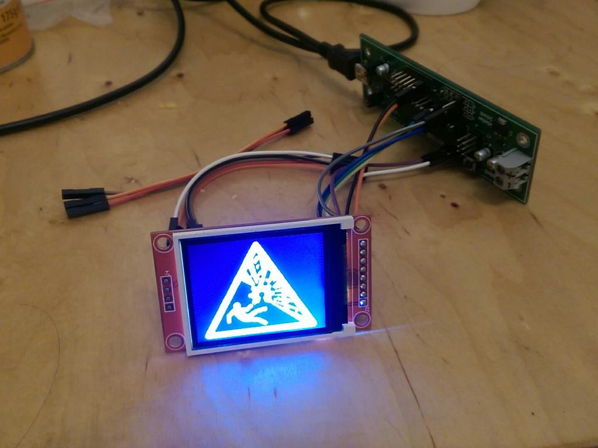

ST7735 for AVR
==============

My simplified plain C version of https://github.com/adafruit/Adafruit-ST7735-Library
and parts of https://github.com/adafruit/Adafruit-GFX-Library/

*Use at your own risk!*

Tweaks
------

By LongHairedHacker:

* Uses my own bitmap format for fullcolor and monochrome bitmaps
* Faster line drawing based on: https://github.com/adafruit/Adafruit-GFX-Library/pull/36
* Faster font rendering based on https://github.com/adafruit/Adafruit-GFX-Library/issues/69
* Refactored draw_char function that does not load glyph struct twice

By Massey101:

* Added support for bitmap clipping
* Added JAYCAR screen for XC4629 support

Usage
-----

Connect the display to the following PINS:

JAYCAR screen and ATMEGA328:
+--------+--------+
| Screen | AVR    |
+--------+--------+
| VCC    | 5V     |
+--------+--------+
| GND    | GND    |
+--------+--------+
| CS     | PB2    |
+--------+--------+
| RESET  | PD7    |
+--------+--------+
| A0     | PD6    |
+--------+--------+
| SDA    | PB3    |
+--------+--------+
| SCK    | PB5    |
+--------+--------+
| LED    | 3.3V   |
+--------+--------+

1. Set the environment variables for:
  - `AVRMCU` - Your avr chip
  - `F_CPU` - Your clock speed
  - `ISPPORT` - programming device
2. Modify `include/st7735.h:st7735_type` to your screen. (I have no idea how to
   figure out which is which)
3. Run `make flash`
